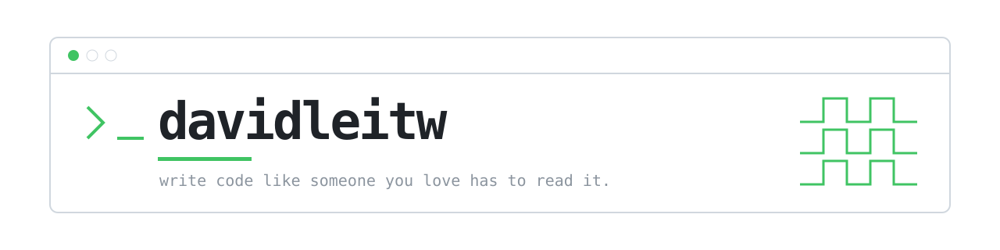
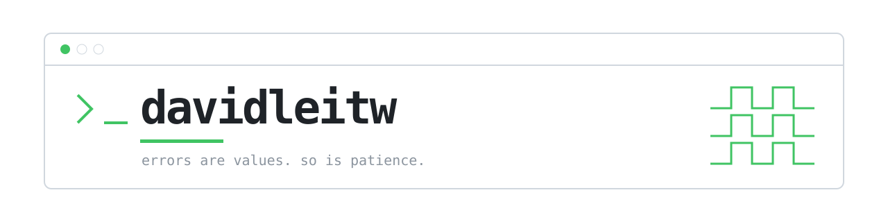

# 台詞四選一

版型定了：終端機視窗。現在只差那行台詞。
名字是「指令」，台詞是「輸出」。

---

### 1 — code is love

最貼近你舉的那句中文。love → full of it 咬同一個字。

---

### 2 — someone you love

反轉「寫程式要當成下一個維護的人是知道你住哪的殺人魔」那句老話。同樣結構，溫度相反。

---

### 3 — errors are values

前半是 Rob Pike 那篇 Go blog 的標題，Go 圈的人會笑。後半接自己的。

---

### 4 — while (coffee)

接你現在 bio 那句咖啡。

---
---

# 完整結構

用第 2 句走一次整頁。

 

最近都在寫給 AI agent 用的工具，也還在寫 Go 跟 C。

[davidleitw.github.io](https://davidleitw.github.io/) · [davidleitw@gmail.com](mailto:davidleitw@gmail.com)

### Contributions

3,394 contributions in the last year · regenerated weekly
