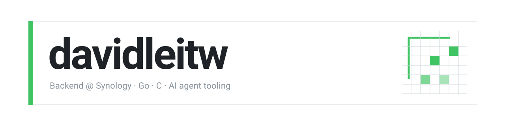
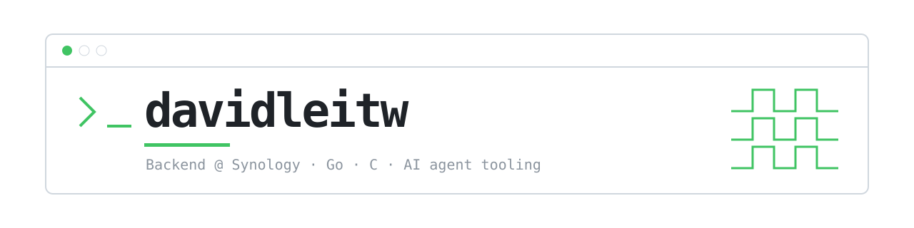
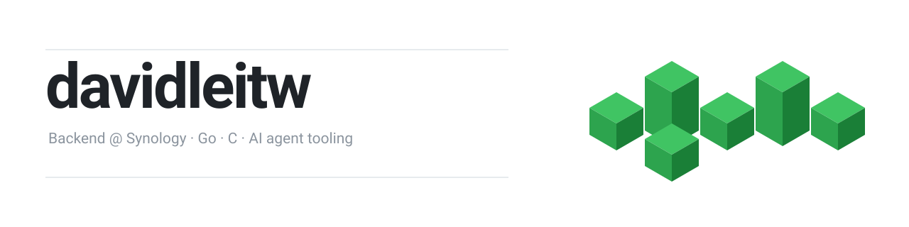

# 封面三選一

三個都放在這裡，用你平常的 GitHub 主題看就好，深淺色會自動切。
選定之後其他兩個會刪掉。

---

### A — 編輯排版

左邊一條綠色粗線當側標，上下細線把名字夾住。右上角一小塊貢獻方格，跟頁面下方那張大圖呼應。

---

### B — 終端機視窗

整個 banner 是一個終端機視窗，左上角三顆燈其中一顆是綠的。名字前面有提示符箭頭，等寬字型。

---

### C — 等角積木

右邊六塊等角立方體，高矮不一，直接沿用下面那張 3D 貢獻圖的視覺語言。

---
---

# 完整結構長這樣

以下用 A 當範例，走完整個頁面：封面 → 自我介紹 → 貢獻圖。

 

**Backend @ Synology** · Go / C

最近都在寫給 AI agent 用的工具。

[davidleitw.github.io](https://davidleitw.github.io/) · [davidleitw@gmail.com](mailto:davidleitw@gmail.com)

### Contributions

3,394 contributions in the last year · regenerated weekly
