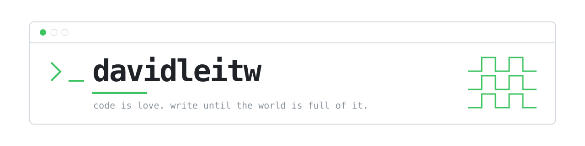
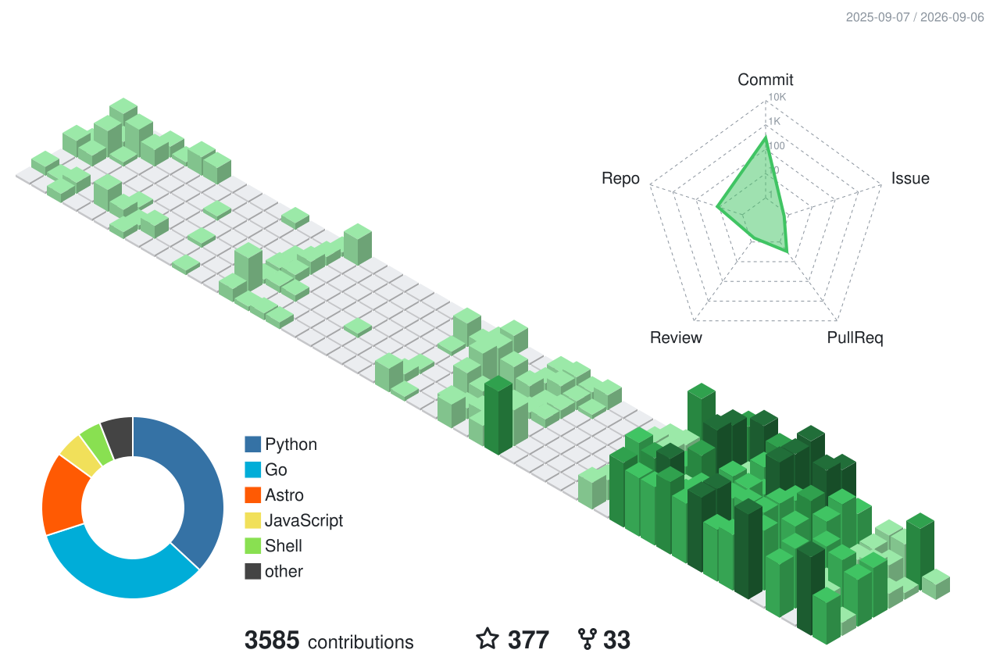

我是 David，平常寫一些自己生活上真的會用到的小專案。自從有了 coding agent，每週的 token 額度大概都花在試各種奇怪的工具上，姑且算是研究。

學資訊工程這一路上受過很多人幫忙，有線上社群認識的，也有現實生活裡的同好，他們其實沒有義務理我。所以如果你有任何問題，歡迎寫信給我，我盡量回。

最近不管工作還是私下都在研究 agent harness 跟它的生態系，也寫過幾個不依賴 framework、可以獨立跑的 harness。這方面都歡迎聊。

### Contributions

3,394 contributions in the last year · regenerated weekly

### Contact

